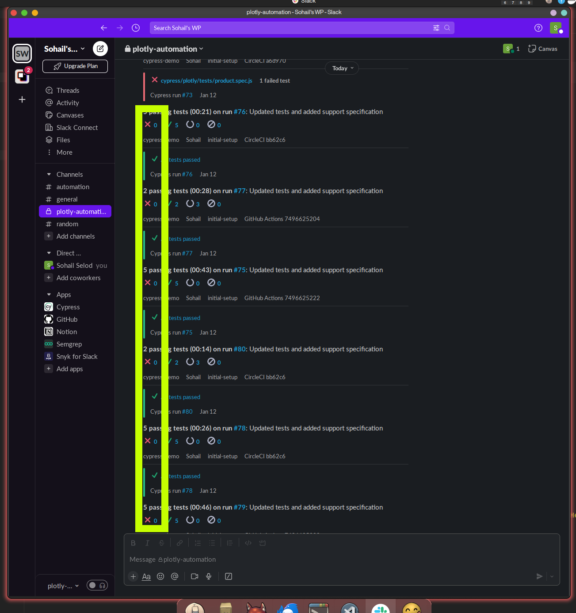

# cypress-demo
### Support:
  - Chromium Family:
    - Electron Brower : No known issues ✅
    - Chrome : No known issues ✅
    - Mobile
      - iPhoneX (viewport) : No known issues ✅
  - Gecko Family
    - Firefox : 1 Known issue ❌ (See below).

### How do I get set up? ###
* Configuration
  - Install Dependencies (see dependencies section below)
  - Via the terminal navigate to the root folder and run "npm install"
  - Each seperate front end project is represented in it's own folder under the root cypress folder e.g. `.../cypress/plotly/`, it can also have it's own cypress configuration files (e.g. cypress.json).

* Dependencies
    * Node.js v21.5.0 [LINK](https://nodejs.org/en/)

* How to run tests:
  * Step 1:
    * Run `npm install` from the root folder
  * Step 2:
    * Run plotly tests: (Note: The default viewport is 1920x1080)
      * HEADLESS
        * On Electron browser: `npm run cy:run`
        * On Chrome: `npm run cy:chrome`
        * On Firefox: `npm run cy:firefox`
        * With Cypress Dashboard ()
          * add `:record` to the above scripts. For e.g.,
            * `npm run cy:firefox:record`
      * HEADED
        * On Electron browser: `npm run cy:run:headed`
        * On Chrome: `npm run cy:chrome:headed`
        * On Firefox: `npm run cy:firefox:headed`
        * With Cypress Dashboard ()
          * add `:record` to the above scripts. For e.g.,
            * `npm run cy:chrome:headed:record`
    * Note: For executions with Cypress Dashboard Record enabled, export the CYPRESS_RECORD_KEY as environment variable instead of passing it in package.json.
      - For Linux Systems: `export CYPRESS_RECORD_KEY=<KEY>`
    * To run specific suites/spec files: `npm run cy:spec:$specFileName` 
      - For E.g. To execute tests from 'cypress/plotly/tests/*product*.spec.js' use `npm run cy:spec:product`

## Contribution guidelines 
* Writing tests
  * Every test must be self contained, meaning it can be run on its own (excluding setups / teardowns). Test should NEVER rely on data or steps from another test.
  * Add `/// <reference types="cypress" />` to the top of file for cypress intellisense.
  * Test must pass 90% of the time in order to be commited; that is if the test is run 10 times in a row it must pass at least 9 times.
  * Only skip test-cases when a bug is reported and remediation is in process and attach Bug info.
  * If a test is no longer valid, it should be decomissioned. 
  * Any additional dependencies to the project must be vetted by the automation team before being committed.
 * Use Page Object Model
 * Use Data Driven model for environment specific data.

* Code review
  * Your first code review should be done via a meeting with someone from the Automation team, this is to make it much less likely that you will need to perform multiple commits to fix any issues
  * There must be NO reported errors from ESlint or Prettier before you commit your code. e.g. JSON data should be stored in JSON files.
  * 90% Pass rate

* Other guidelines
  * Follow DRY principles in your code
  * Page object classes MUST have PascalCase
  * All variables, methods, functions MUST be camelCase
  * All Global Variables and DB methods MUST be UPPERCASE (WITH SNAKE_CASE)
  * All cypress aliases MUST be snake_case
  * For consistency it is recommended to follow `filename1.page.js` for page object files. Similarly `filename2.spec.js` for test spec files.

## Bonus Section
- Bonus testcase with bug breakdown. And post remediation testcase.
- Linter / Code Formatter
  - ESLint - Linter
  - Prettier - Code Formatter
- Github Actions Integration
  - Runs test on Firefox, Chrome, Electron (default browser).
  - Git Secrets/Credentials Check
  - OWASP Dependency Check
- CircleCI Inregration
  - Runs test on Firefox, Chrome, iPhoneX.
- Cypress Dashboard Integration
  - Gets results from CircleCI, GitHub Actions and Local (when `--record` or `:record` is provided)
- Slack Integration
  - Notifies of execution results that are sent to Cypress Dashboard (all mentioned in above point).
  - The goal is to have 6 zeroes lined up, as we have total of 6 CI/CD runners.
      

### List of known issues
* `cy.visit()` - Intermittently fails for current version of Firefox, hence firefox execution is restricted to default.spec.js on local. See [Github issue](https://github.com/cypress-io/cypress/issues/2938).
